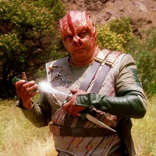

darmok
====



C++ game engine combining opensource libraries & tools that I like

currently using:

* [bgfx](https://github.com/bkaradzic/bgfx) as the renderer
* [CMake](https://cmake.org/) as the build system 
* [vcpkg](https://vcpkg.io) as the package manager
* [glm](https://github.com/g-truc/glm) for 3d math
* [EnTT](https://github.com/skypjack/entt) as the entity component system
* [assimp](https://github.com/assimp/assimp) for generic asset loading (not in runtime)
* [sol2](https://github.com/ThePhD/sol2) modern C++ bindings for lua
* [nlohmann-json](https://github.com/nlohmann/json) for parsing json
* [pugixml](https://pugixml.org/) for parsing xml
* [imgui](https://github.com/ocornut/imgui) for editor UI
* [RmlUI](https://github.com/mikke89/RmlUi) for ingame UI to replace CEGUI
* [ozz](https://github.com/guillaumeblanc/ozz-animation/) for 3d skeletal animations
* [cereal](https://uscilab.github.io/cereal/) for serialization
* [tweeny](https://github.com/mobius3/tweeny) for tweening and easings
* [Jolt](https://github.com/jrouwe/JoltPhysics) for 3D physics

planned to use:

* [miniaudio](https://miniaud.io/) for audio
* need to decide 2D physics
    * [Box2D](https://box2d.org/)
    * [Chipmunk2D](https://github.com/slembcke/Chipmunk2D)
* [ldtk](https://ldtk.io/) for 2D level editor
* [spine](https://github.com/EsotericSoftware/spine-runtimes) for 2d skeletal animations
* [taskflow](https://github.com/taskflow/taskflow) for multithreaded updates

Trying to use modern C++ patterns where possible.

Trying to target the following platforms:
* desktop (windows, macos, linux)
* mobile (iOS, Android) (pending)

Some philosofical decisions (could be controversial)
* no game editor, will use external tools (blender, ldtk, etc...)
* use as much stl as possible (need to look into memory management at some point)
* no naked pointers
* throw exceptions for error handling
* try to keep the API similar to Unity3D (where it makes sense) so that it's easy to port game logic

**WARNING**: currently in early stages of development

## Frequently Asked Questions

* Will it have feature X?
> Depends on what I need. Anyone is welcome to fork and submit PRs.

## Current State

I'm still learning CMake, so if you see something that should be fixed please let me know.

### Working features

* bgfx window setup (GLFW on windows & linux)
* scene using entt
* update logic methods with delta time
* sprites and spritesheets
* loading models using assimp (FBX, etc...)
* serializing models from assimp into binary using cereal
* renderer
    * unlit
    * forward with phong lighting (point, ambient)
* lua scripting
    * lua debugging
* multiple UI options
    * imgui for tooling
    * RmlUI for ingame (support for multiple canvases)
* skeletal animations using ozz (reading from binary)
* 3d physics using jolt
    * rigidbodies
    * character controller
* tool to export asset folders 
    * shaders & vertex layouts
    * copy files
    * assimp to custom binary model format
    * ozz skeleton & animations
* dynamic font texture generation

#### Upcoming (I need them)
* lua camera renderer
* sound

#### Upcoming
* render graph
* replace Data for std::vector<uint8_t> and DataView for std::span<uint8_t>
* text improvements
    * finish all the TextRenderConfig options
    * dynamic distance field rendering with border support
* clipboard text support (UTF8)
* loaders should return unique_ptr
* move lua bindings to separate library?
* defines when exporting shaders (generate all variations like Unity)
* frustrum culling
* more stuff serialization
    * binary texture atlas
    * material
* loading progress
* modernize renderer (probably needs frame graph or similar)
    * deferred
    * other types of lights
    * physically based renderer
    * SSAO

#### In the future
* unit tests, I know
* performance profiling
* 2d physics
* separate shaders for skinning?
* instancing meshes
* support multiple imgui app components with different transforms
* spine animations loading
* unify use of allocators everywhere
* progressive asset loaders
* async task management
* lua debugging would be nice
* particle systems (maybe effekseer)

## Interesting Related Projects
* [SuperNovaEngine](https://github.com/skaarj1989/SupernovaEngine) a very similar engine but much more advanced
* [FrameGraph](https://github.com/skaarj1989/FrameGraph) renderer agnostic frame graph library 
* [dome engine](https://github.com/domeengine/dome) - minimalist engine with wren as the scripting language
* [RaZ engine](https://github.com/Razakhel/RaZ) - C++17 game engine
* [cluster](https://github.com/pezcode/Cluster) - PBR implementation for bgfx

## Example code

```lua
program = app.assets:load_standard_program(StandardProgramType.ForwardPhong)

camEntity = app.scene:create_entity()
camTrans = camEntity:add_component(Transform, { 0, 2, -2 })
camTrans:look_at({ 0, 0, 0 })
local cam = camEntity:add_component(Camera)
cam:set_projection(60, { 0.3, 1000 })
cam:set_renderer(ForwardRenderer)
cam:add_component(PhongLightingComponent)

lightEntity = app.scene:create_entity()
lightEntity:add_component(Transform, { 1, 1, -2 })
lightEntity:add_component(PointLight)

cubeMesh = MeshData.new_cube().createMesh(program.vertex_layout)
greenTex = app.assets:load_color_texture(Color.green)
app.scene:create_entity():add_component(Renderable, cubeMesh, program, greenTex)
```